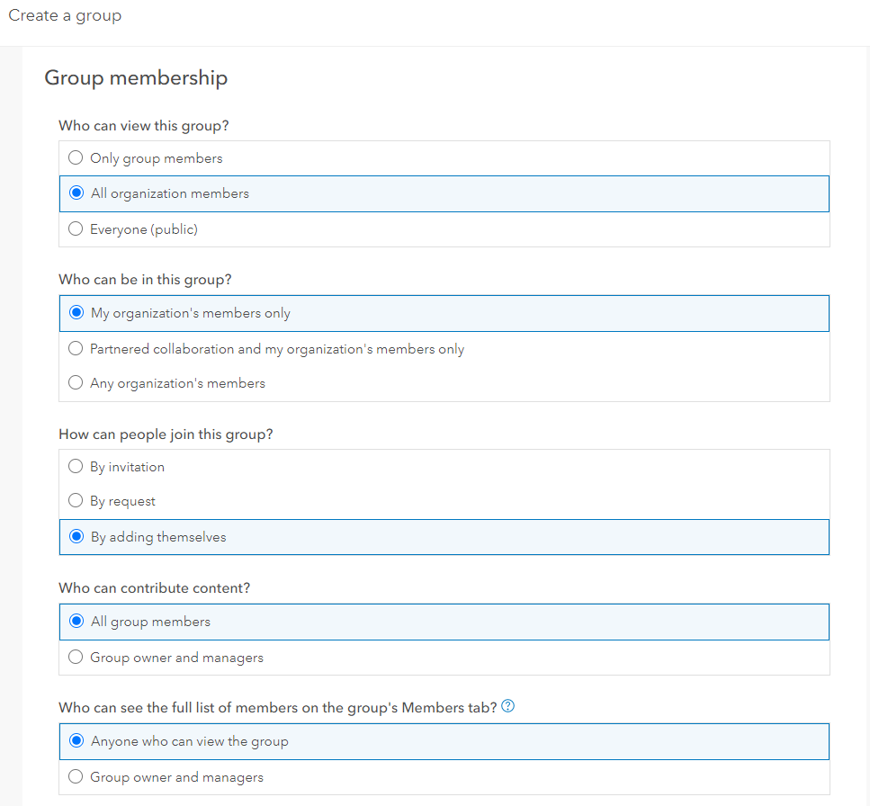
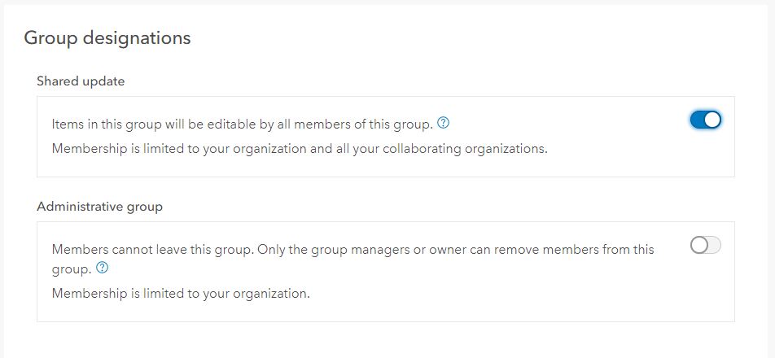

# Creating Groups where all members can update or edit content 
Regardless of who setups up the group, there is one setting that MUST be enabled at the creation of the Group. Most other settings can be modified after the creation, expect this one.
  The Setting:  "Shared Update"
Read more from [Esri on creating groups](https://doc.arcgis.com/en/arcgis-online/share-maps/create-groups.htm).
  
1. From the ArcGIS menu bar, select **Groups**
2. Click **Create Group**
3. If you have an image, you can upload it to the thumbnail. This is not necessary. If you do not upload an image, the default will take on the first letter used for the group name.
4. Provide a name for the group, a brief summary, and tags. Below are some guidelines as well as an example. 
    - **Group Name:** Use something meaningful and if you plan to do this assignment again in the future with a different group of individuals, think about adding the quarter or year to the group name.
    - **Summary:** A brief summary can expand on the title to provide a bit more information. For example, is the group intended for final projects only or for working on a project?
    - **Tags:**  will help individuals find this group when searching
   
   
 
 5. Set the remaining Group settings (see image below for one recommendation):
 
 ## Group Membership
 - **Who can view this group:** Unless you need content shared outside of the UCSD ArcGIS Online Organization, setting it to just "People in the organization (University of California San Diego) should be sufficient. If you have sensitive content that you don't want viewable to anyone inside the UCSD Org, you can set it to "only group members". The setting you choose here will limit the option "who can join the group". This setting can be changed after the group is created. 
  - **Who can be in this group:**  will only display if you have enabled People inside the organization or Everyone to *view* the group. This setting can be changed after the group is created.
      - *Organization members only* only UC San Diego organization members can be added to the group.
      - *Organization and partnered collaboration members only* only members of the UC San Diego organization or organizations that is a partnered collaboration with can join. A partnered collaboration will required administrative support. A partnered collaboration is not a guarantee, as both organizations must agree to setup a partnered collaboration. If you want to create a group with shared update capabilities and have members from other organizations added to that group with editing permissions, you must use this one.
      - *Any organization's members* any organization member can join the group without being invited or approved. Members of other organizations can join the group as long as they have privileges to join external groups. With this option selected, you cannot create a group with shared updated capabilities. 
  - **Who can join this group:**  will only display if you have enabled People inside the organization or Everyone to *view* the group. This setting can be changed after the group is created.
      - *By invitation* group owners or group managers must inviteall individuals to join the group.
      - *By request* those who request membership must be approved by a group manager or group owner. Group manager roles are assigned after you have more than just the owner of the group as a member.
      - *By adding themselves* this enables anyone who can view the group to join. This is great for getting large classes into a group. This setting can then be modified after most individuals are in the group to *by invitation* or *by request*. 
   - **Who can contribute to the group:** best to leave the default to group members. This setting can be changed after the group is created.
   - **Who can see the list of members on the Members tab:** best to leave the default to group members. This setting can be changed after the group is created.
     
     
## Group designations
Modify these settings based on your needs.
   - **Shared update** This setting supports what items in the group can its members update. This is the setting that **CANNOT** be changed after a group is created. This is the setting you will need to change if you want individuals to edit another members data, maps, apps or colloabrate on StoryMaps. The ability to enable this depends on your group membership settings above.
   - **Administrative group** members cannot leave this group on their own.
   - **Open Data** if you want content to be accessible in Open Data Sites. Group visibility must be set to Everyone for this option to be available.

  
  *Example settings for creating Groups where members need permissions to edit others' content*
  
6. Click button to **Create Group**
