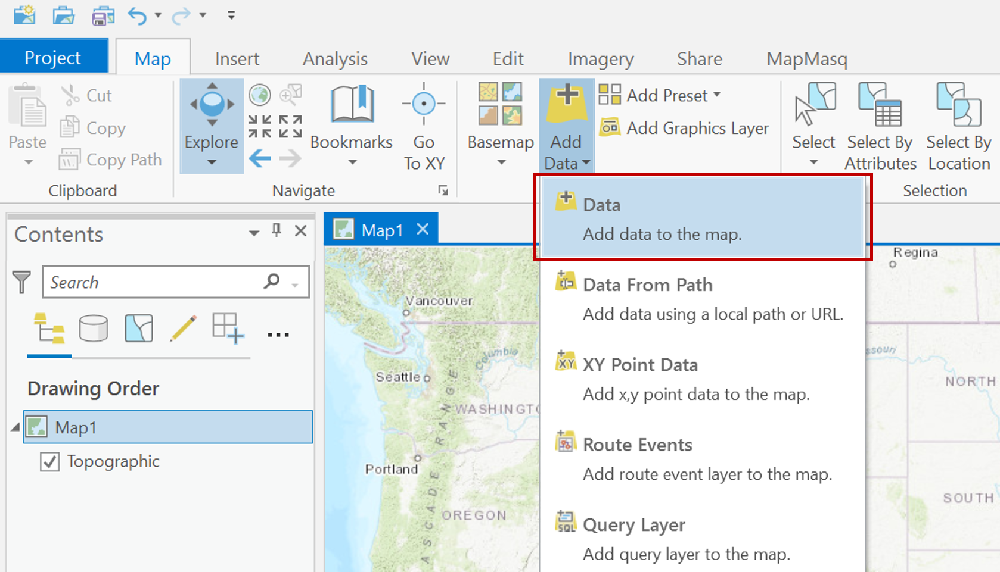
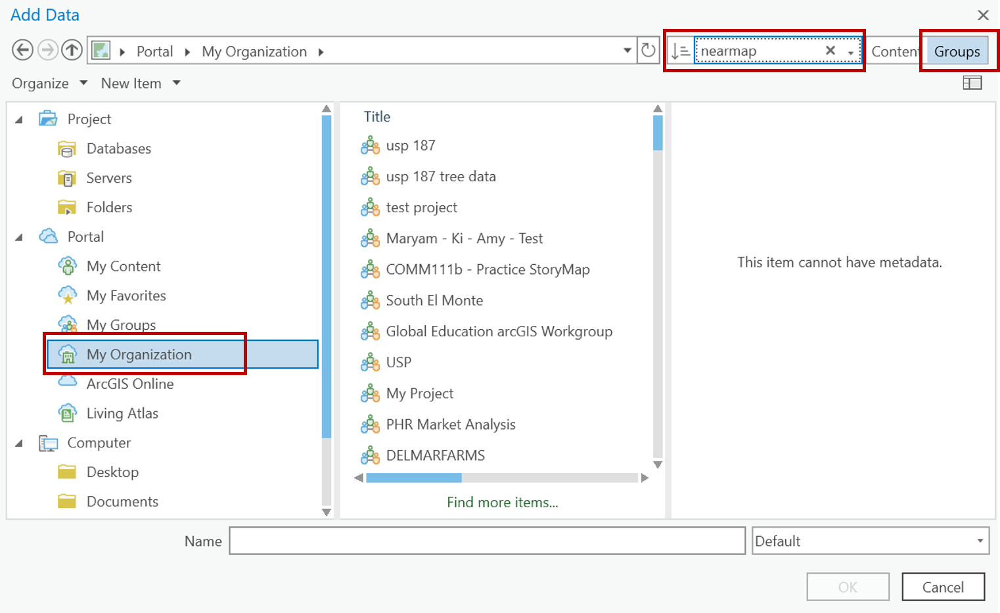
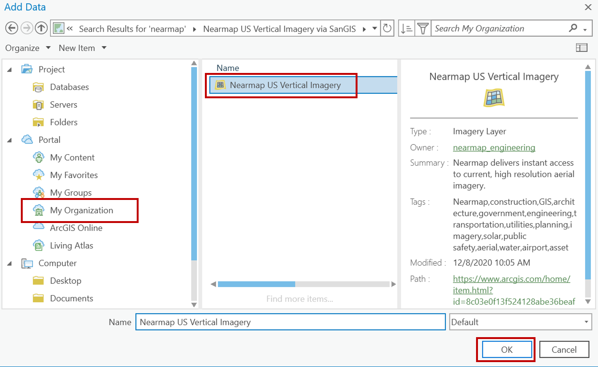
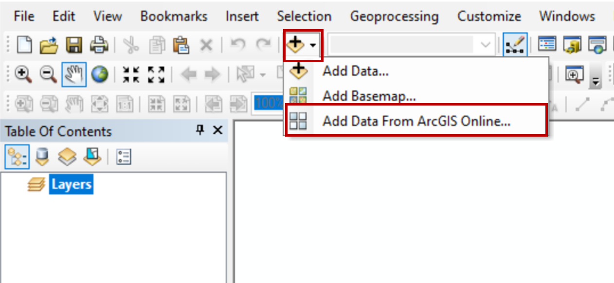
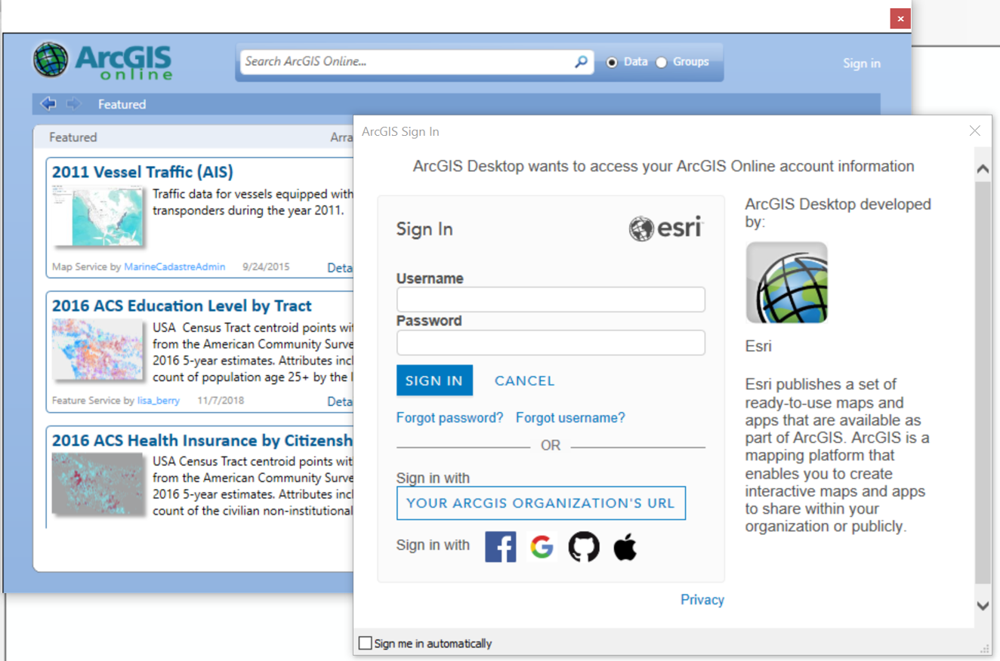
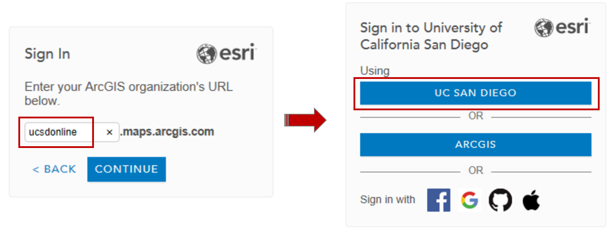
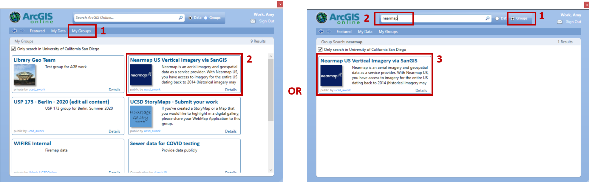
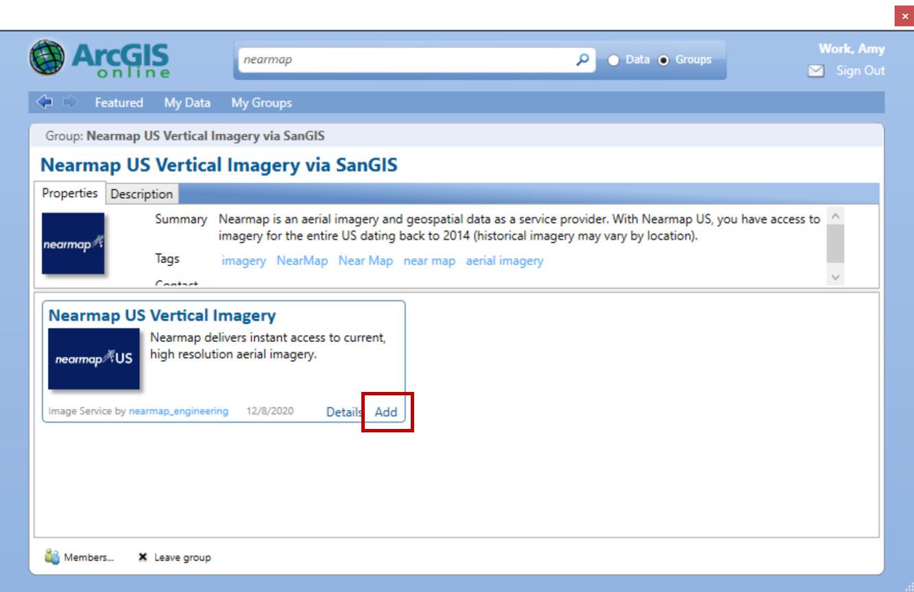

# Nearmap
UC San Diego has access to Nearmap imagery through the San Diego Imagery Consortium. San Diego Imagery Consortium is a 3-year agreement to access to Nearmap imagery and obliques for the entire U.S., dating back to 2014. Image availability varies across the U.S. Our licnese agreement currently does not support 3D data.  

Please refer to the [NearMap documentation for Integrations](https://docs.nearmap.com/display/ND/INTEGRATIONS).

For use in Esri-based products, access to Nearmap imagery is automatically granted to all UC San Diego affiliates who log in to ArcGIS Online using the SSO option. 

If you would like to access Nearmap imagery in QGIS or other platforms, you will need to reach out to the [GIS Librarian at UC San Diego](https://ucsd.libguides.com/gis/gisucsd) to get an API key. 

## Accessing Nearmap Imagery in ArcGIS Pro
1. You must be signed into ArcGIS Pro with your UC San Diego ArcGIS Online credentials. Same process and credentials used to access [ucsdonline.maps.arcgis.com](https://ucsdonline.maps.arcgis.com)
1. **Add Data**

   

1. Under Portal, select **My Organization**. Search for *nearmap* in **Groups**.

   

1. Select the Nearmap US Vertical Imagery layer. OK.

   

### Working with Nearmap in ArcGIS Pro
- [Configure the Time Field for historical imagery (step 2)](https://docs.nearmap.com/display/ND/Enable+Historical+Imagery+in+ArcGIS+Pro)

## Accessing Nearmap Imagery in ArcGIS Online
1. Sign in to UC San Diego ArcGIS Online (https://ucsdonline.maps.arcgis.com) 
1. Open a Map
1. **Add Data**
1. Browse **Subscription Layers**

   

1. Add Nearmap US Verticle Imagery to your map

    

### Working with Nearmap in ArcGIS Online 
- [Enable Historical Imagery](https://docs.nearmap.com/display/ND/Enable+Historical+Imagery+in+ArcGIS+Online)
- [Make Nearmap Imagery the Basemap](https://docs.nearmap.com/display/ND/Make+Nearmap+Imagery+the+Basemap)

## Accessing Nearmap Imagery in ArcGIS Desktop
It will be helpful to have other data in your map that will help locata you to your area of interest. When you first bring in Nearmap, it does not display at the global scale. You need to be zoomed to an area of interest for the imagery to display.

1. **Add Data** and then **Add Data from ArcGIS Online**

   

1. **Sign In** using **Your ArcGIS Online Organizational URL**. Enter *ucsdonline*.

   

1. Enter *ucsdonline* and sign in with your AD credentials

   
   
 1. You can search for Nearmap one of two ways. Search "My Groups" or search for "Nearmap" in "Groups".
 
    
    
 1. Add NearMap to your map document. 
 
     
