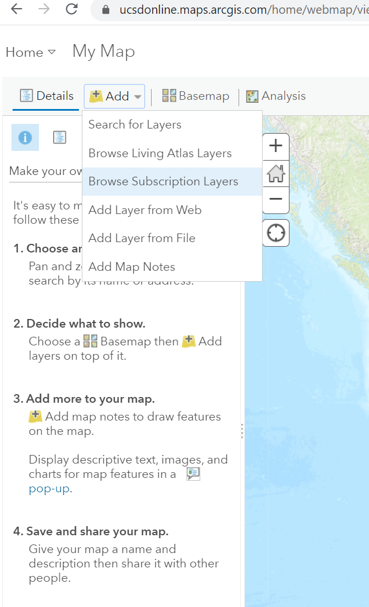
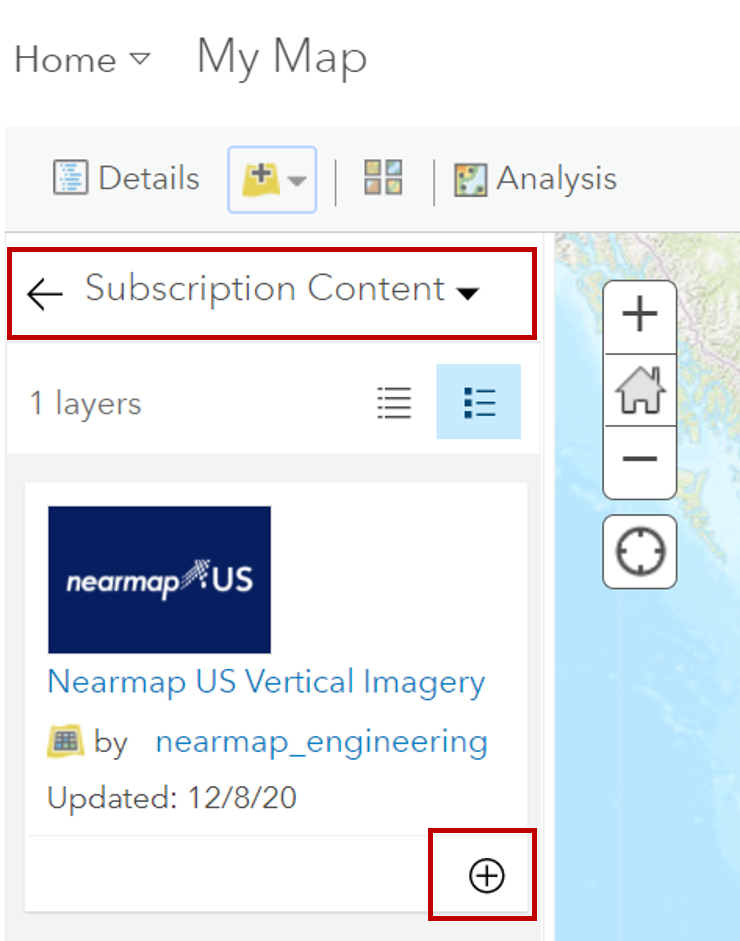

# Nearmap
UC San Diego has access to Nearmap imagery through the San Diego Imagery Consortium. San Diego Imagery Consortium is a 3-year agreement to access to Nearmap imagery and obliques for the entire U.S., dating back to 2014. Image availability varies across the U.S. 

Please refer to the [NearMap documentation for Integrations](https://docs.nearmap.com/display/ND/INTEGRATIONS).

For use in Esri-based products, access to Nearmap imagery is automatically granted to all UC San Diego affiliates who log in to ArcGIS Online using the SSO option. 

## Accessing Nearmap Imagery in ArcGIS Pro
1. Ensure that you are logged in to ArcGIS Pro using your UC San Diego ArcGIS Login credentials.
1. 

## Accessing Nearmap Imagery in ArcGIS Online
1. Sign in to UC San Diego ArcGIS Online (https://ucsdonline.maps.arcgis.com) 
1. Open a Map
1. Add Data
1. Browse Subscription Layers

   

1. Add Nearmap US Verticle Imagery to your map

    

Working with Nearmap 
- [Enable Historical Imagery](https://docs.nearmap.com/display/ND/Enable+Historical+Imagery+in+ArcGIS+Online)
- [Make Nearmap Imagery the Basemap](https://docs.nearmap.com/display/ND/Make+Nearmap+Imagery+the+Basemap)
