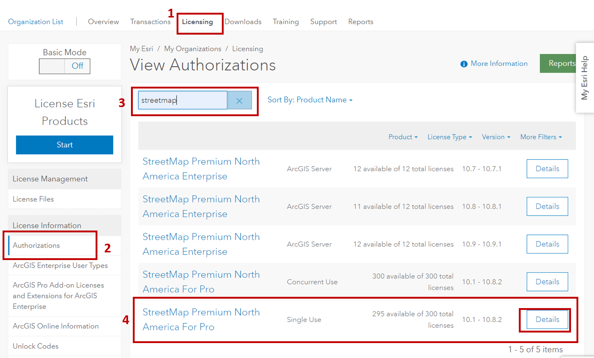
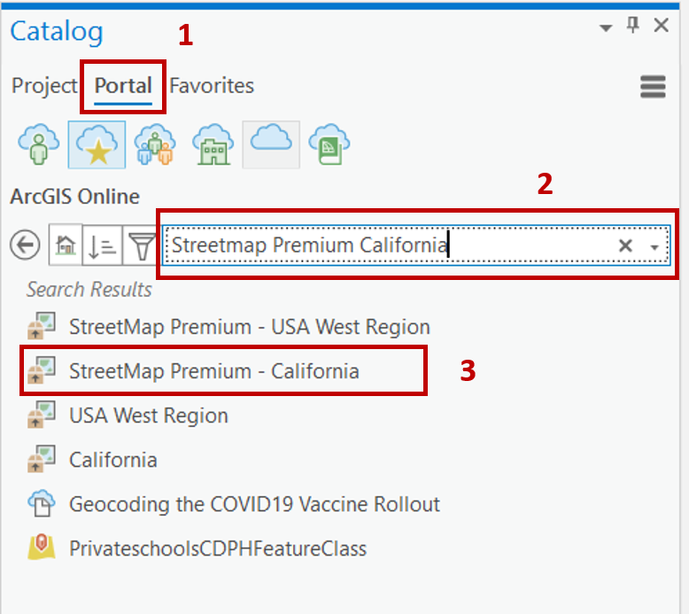

# Licensing Esri StreetMap Premium for offline use
The following steps are intended for the University of California Esri Consortium. The Administrative Steps are specifically for those who have purchased Esri StreetMap Premium through UCOP as part of the Esri consortium. The user steps for authorization from a connected and disconnected computer could be adjusted and applied to support any campus with access to an Esri StreetMap Premium License.

[Administrative Steps for Esri License Administrators](#Administrative-Steps-for-Esri-License-Administrators)\
[User Setup for authorization with a CONNECTED computer](#User-Setup-for-authorization-with-a-CONNECTED-computer)\
[User Setup for authorization with a DISCONNECTED computer](#User-Setup-for-authorization-with-a-DISCONNECTED-computer)\
[Download Streetmap Premium data from ArcCatalog to local machine](#Download-Streetmap-Premium-data-from-ArcCatalog-to-local-machine)

## Administrative Steps for Esri License Administrators  
1. Reach out to Mono Simeone at UCSF for an autorization number that can be shared with up to XX users to authorize StreetMap Premium on a desktop. Mono has already licensed 50 authorizations numbers for each campus (that have purchased StreetMap Premium).

OR if you have access to the UCOP MyEsri space

1. Set active Organization to:  University of California, Office of the President (UCOP)
2. From top menu, click **Licensing**
3. From left menu, click **Authorizations** under License Information
4. Search Streetmap Premium in the seach box.
5. Click **Details** next to StreetMap Premium North America for Pro.
6. Search for your Campus Name and Copy the Authorizaiton number  

 

   

## User Setup for authorization with a CONNECTED computer
If you can have the computer you are setting up SMP connected to the internet for the authorization process, follow these steps. If the computer is already in a disconnected state, follow the setup for [User Setup for authorization with a disconnected computer](#User-Setup-for-authorization-with-a-disconnected-computer)

1.	Open ArcGIS Pro
2.	Under Project/Settings open up the Licensing options
3.	Click ‘Configure Your Licensing Options’
4.	Click ‘Authorize’
5.	Select ‘I have already authorized the software and need to authorize additional extensions’
6.	Because your computer is connected to the internet, you can choose the first option:  ‘Authorize with Esri now using the Internet’. 
7.	In the Software Authorization Wizard popup, enter the following in the blue highlighted space
    1.	Feature = Street Map Premium 
    2.	Authorization Number = ESUXXXXXXXXX *(acquire the authorization number from your Campus Esri License Administrator)*
8.	Click Next
9.	Finish the process

## User Setup for authorization with a DISCONNECTED computer
If you have a computer that is completely disconnected from the internet for setup and authorization, follow these steps. It's a few extra steps, but will work.
1.	Open ArcGIS Pro
2.	Under Project/Settings open up the Licensing options
3.	Click ‘Configure Your Licensing Options’
4.	Select ‘I have already authorized the software and need to authorize additional extensions’
5.	If your computer was connected you could choose the first option. Because your computer is not connected, select the second option ‘Authorize at Esri’s website or by email to receive your authorization file’. 
6.	In the Software Authorization Wizard popup, enter the following in the blue highlighted space
    1. Feature = Street Map Premium 
    2. Authorization Number = ESUXXXXXXXXX *(acquire the authorization number from your Campus Esri License Administrator)*
7.	Click Next
8.	Save the Authorization file (you’ll need to get the authorization file to a computer that has internet access)
9.	On a connected computer, follow the steps provided on the last step
    1. Go to:  https://my.esri.com/#/activations/secure-site
    2. Sign in using the My Organization URL
        1. Enter UCSD Online
        2. Sign in using your AD credentials 
    3. Once signed in, choose the Auth file
    4. Upload  
10.	Download the Resulting Authorization.respc file (take this file back to the offline computer)
11.	Back in Pro in your Licensing options, you’ll need to Configure License file again
    1. Select “I have received an authorization file from Esri and am now ready to finish the authorization process”
12.	Follow the steps

## Download Streetmap Premium data from ArcCatalog to local machine
There are several ways to install the Streetmap Premium data locally to your machine. The process below allows you to identify the region of interest and download just that data rather than the all the data for North America (*UCOP licnese includes only the [geographic coverage area of North America](https://doc.arcgis.com/en/streetmap-premium/coverage/product-coverage.htm#ESRI_SECTION2_AC035FCDC0024A10BCA7FE0D0B3C1342). Reach out to your own campus if you need other geographic areas.*)

In order to install the data, you must be connected to an environment. Then can disconnect and geocode or transfer to your disconnected computer. 

1. Open and sign into ArcGIS Pro
2.	From within Pro, open your Catalog box and search for StreetMap Premium California (or whatever geography you need that falls within North America). The SMP data in ArcGIS Online is available as map packages. When you add the package to your Pro project and it downloads the SMP data to your computer. You can search for any geographic region in North America.

 

  
 
4.	With the data now local, you can geocode and do routing using the local data. You must be intentional about choosing the local resources.  For example, for geocoding, they need to make sure and use the USA locator. That is the one that comes with SMP for US data. The ArcGIS World Geocoding Service uses data from ArcGIS Online.
