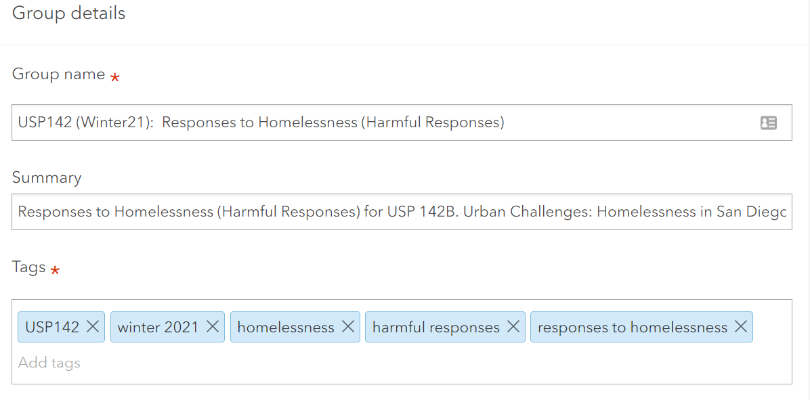
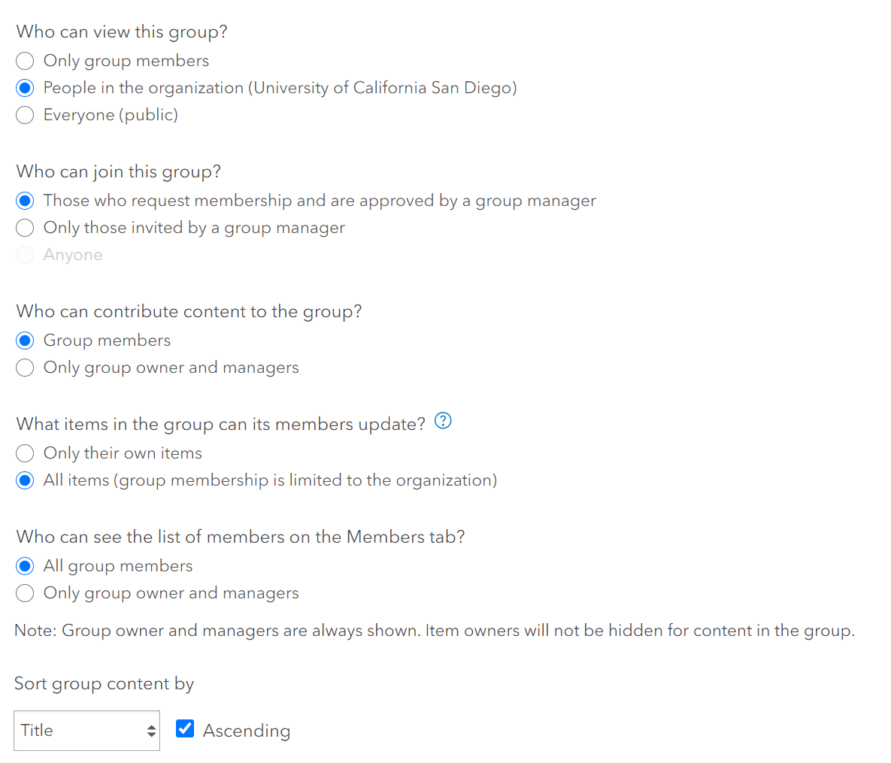
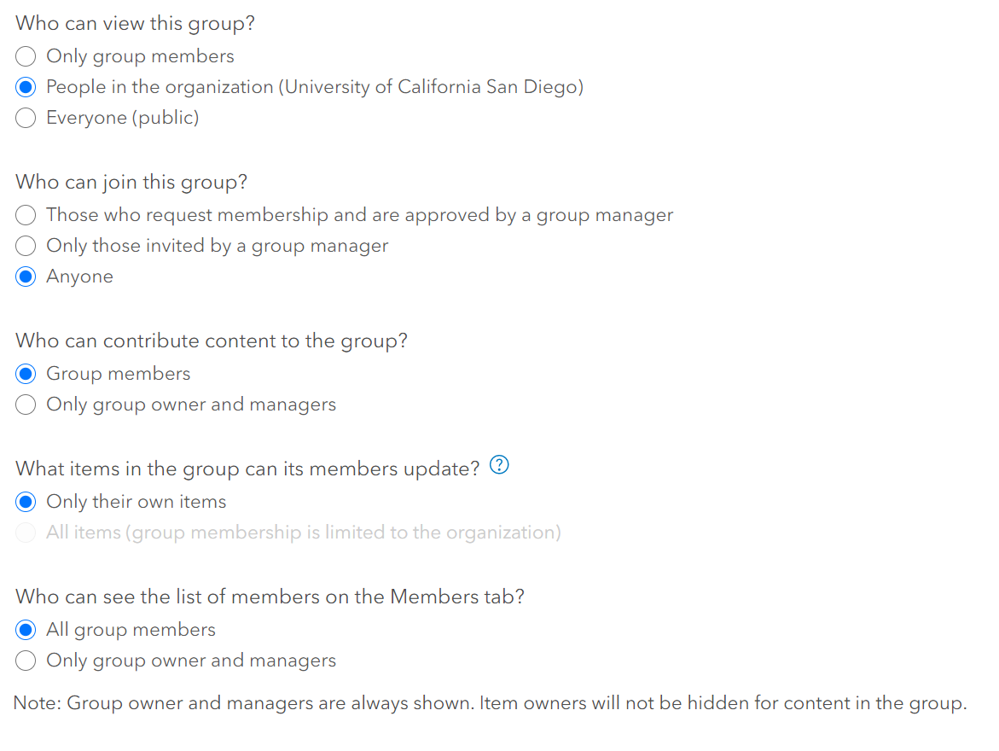

#DRAFT in progress
The information below is to assist those instructors in managing some of the logists when using StoryMaps in class. These are suggestions, not absolute rules. You can modify as you see appropriate to your class setting.

[Tips to keep in mind](#tips-to-keep-in-mind)
[Creating StoryMaps](#creating-storymaps)\
    [Individuals will create their OWN StoryMap](#individuals-will-create-their-own-storymap)\
    [TEAM StoryMaps](#team-storymaps)\
[Creating Groups where all members can update or edit content](#creating-groups-where-all-members-can-update-or-edit-content)\
[Submission of Final StoryMaps](#submission-of-final-storymaps)\

## Tips to keep in mind
- Individual and team StoryMaps are possible. 
- All StoryMaps are saved inside ArcGIS Online. For managing StoryMaps content for your class, you will want to work within ArcGIS Online. You can still use storymaps.arcgis.com for creating StoryMaps
- For team StoryMaps, the thing to keep in mind is that you CANNOT have multiple people working on the StoryMap at the same time (e.g. StoryMaps do not currently operate like Google, where multilpe people can be working on the same item at the same time). If it's desired to have individuals work together as a team to complete a single StoryMap, it will require coordination for who can work on the StoryMap at any given time. When someone is done working on their portion of the StoryMap, they should close the window. If a window is left open, it can cause issues for the next person who opens the StoryMap up to work on it. However, classes have had individuals work on their own as well as in groups.
- For Team StoryMaps, a group should be created for each group using the settings below. 
- For Individual StoryMaps, you can created a single group for the class. 
- At any point, you can create multiple groups. This might be appropriate if you want to have a "practice StoryMap submission" and a "Final Project Submission". Just be sure to name the groups accordingly. 

# Creating StoryMaps

## Individuals will create their OWN StoryMap
1. Individuals can get started with creating StoryMaps immediately. 
  - Individuals must have logged into the UCSD ArcGIS Online Organization [ucsdonline.maps.arcgis.com](https://ucsdonline.maps.arcgis.com/) using their UCSD AD credentials. [Follow the steps in Option 1](https://ucsd.libguides.com/gis/arcgisaccount) to setup an account.
  - StoryMaps can be access from the main [UCSD ArcGIS Online Organization](https://ucsdonline.maps.arcgis.com/) using the keypad icon  or directly from [Storymaps.arcgis.com](http://storymaps.arcgis.com/).

## TEAM StoryMaps
*This setup will support a team of individuals to create one or more StoryMaps together. You will need to setup an ArcGIS **Group** with a particular setting to enable individuals to edit other's content, in this case a StoryMap. Best practice will be for each team of individuals to have their own ArcGIS Group (e.g. five teams will result in five separate groups)*
1. Individuals will need to setup a Group inside ArcGIS Online. This task can be assigned to one member of the group or or an instructor or TA can do this.

### Creating Groups where all members can update or edit content 
Regardless of who setups up the group, there is one setting that MUST be enabled at the creation of the Group. Most other settings can be modified after the creation, expect this one.
  The Setting:  "What items in the group can its members update?"
  
1. From the ArcGIS menu bar, select **Groups**
2. Click **Create Group**
3. If you have an image, you can upload it to the thumbnail. This is not necessary. If you do not upload an image, the default will take on the first letter used for the group name.
4. Provide a name for the group, a brief summary, and tags. Below are some guidelines as well as an example. 
    - **Group Name:** Use something meaningful and if you plan to do this assignment again in the future with a different group of individuals, think about adding the quarter or year to the group name.
    - **Summary:** A brief summary can expand on the title to provide a bit more information. For example, is the group intended for final projects only or for working on a project?
    - **Tags:**  will help individuals find this group when searching
   
   
 
 5. Set the remaining Group settings (see image below for one recommendtation):
    - **Who can view this group:** Unless you need content shared outside of the UCSD ArcGIS Online Organization, setting it to just "People in the organization (University of California San Diego) should be sufficient. If you have sensitive content that you don't want viewable to anyone inside the UCSD Org, you can set it to "only group members". The setting you choose here will limit the option "who can join the group". This setting can be changed after the group is created. 
    - **Who can join this group:**  will only display if you have enabled People inside the organization or Everyone to *view* the group. This setting can be changed after the group is created.
        - *Those who request membership and are approved by a group manager* means you open the group up to anyone can request to join, but approval must be granted by 1) the person who set the group up or 2) a group manager, a role assigned after you have more than just the creator of the group as a member.
        - *Only those invited by a group manager* you must manually invite all individuals to join the group. 
     - **Who can contribute to the group:** best to leave the default to group members. This setting can be changed after the group is created.
     - **What items in the group can its members update:** This is the setting that **CANNOT** be changed after a group is created. This is the setting you will need to change if you want individuals to colloabrate on StoryMaps. 
        - *Only their own items:* members cannot edit others' content shared with the group. You want this setting if students are working on their own StoryMaps.
        - *All items (group membership is limited to the organization):* This enables members to edit others' content. You want this setting if you want multiple individuals to work on the same StoryMap. Best practice if you have multiple teams, is for each team to have their own group. 
      - **Who can see the list of members on the Members tab:** best to leave the default to group members. This setting can be changed after the group is created.
      - You leave the defaults or modify the other settings based on your needs.
    6. Click button to **Create Group**

  
  *Example settings for creating Groups where members need permissions to edit others' content*

# Submission of Final StoryMaps
Regardless of how StoryMaps are created, a good practice is to create a Group where indivdiuals can submit their final StoryMaps. 
  1. From the ArcGIS menu bar, select **Groups**
  2. Click **Create Group**
  3. If you have an image, you can upload it to the thumbnail. This is not necessary. If you do not upload an image, the default will take on the first letter used for the group name.
  4. Provide a name for the group, a brief summary, and tags. Below are some guidelines as well as an example. 
      - **Group Name:** Use something meaningful and if you plan to do this assignment again in the future with a different group of individuals, think about adding the quarter or year to the group name.
      - **Summary:** A brief summary can expand on the title to provide a bit more information. For example, is the group intended for final projects only or for working on a project?
      - **Tags:**  will help individuals find this group when searching
  5. Set the remaining groups settings (see image below for one recommendation):
      - **Who can view this group:** Unless you need content shared outside of the UCSD ArcGIS Online Organization, setting it to just "People in the organization (University of California San Diego) should be sufficient. If you have sensitive content that you don't want viewable to anyone inside the UCSD Org, you can set it to "only group members". If you would like future classes to view StoryMaps created by others in the past, the recommended setting is to share to "People in the organization (University of California San Diego).  
      - **Who can join this group:**  will only display if you have enabled People inside the organization or Everyone to *view* the group. For minimum management, you can set the initial setting to Anyone, and then after a specific amount of time or the class has ended, you can change the setting to be more restrictive and allow you to manage who joins the group. This setting can be changed after the group is created.
        - *Those who request membership and are approved by a group manager* means you open the group up to anyone can request to join, but approval must be granted by 1) the person who set the group up or 2) a group manager, a role assigned after you have more than just the creator of the group as a member.
        - *Only those invited by a group manager* you must manually invite all individuals to join the group. 
        - *Anyone* enables anyone to join the group. If you set the previous setting to "who can view the group" to just UCSD, then only people inside the UCSD ArcGIS Online Org can join. If you set the previou setting to "public" than anyone who can find the group can join without approval. 
     - **Who can contribute to the group:** best to leave the default to group members. This setting can be changed after the group is created.
     - **What items in the group can its members update:** This is the setting that **CANNOT** be changed after a group is created. For final project submissions, you want the default setting of *Only their own items*. If you enable Anyone to join the group, you will see you only have the default option available.  
      - **Who can see the list of members on the Members tab:** best to leave the default to group members. This setting can be changed after the group is created.
      - You leave the defaults or modify the other settings based on your needs.
  6. Click button to **Create Group**
  
  

