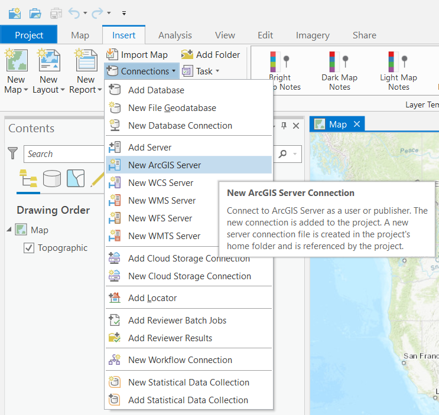
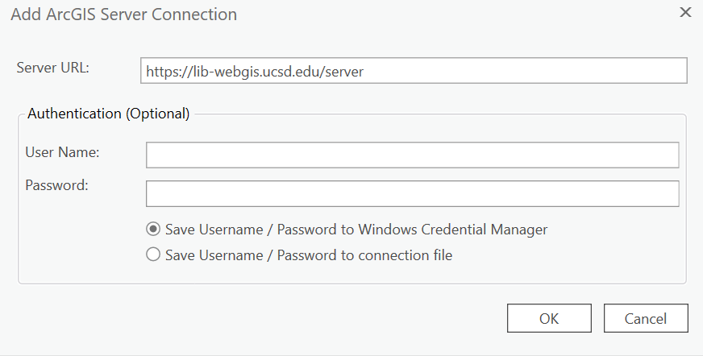
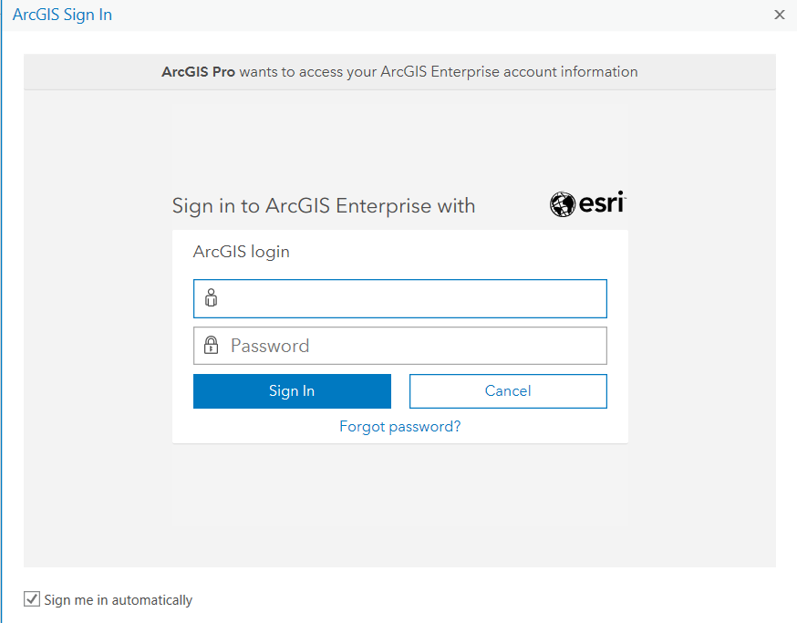
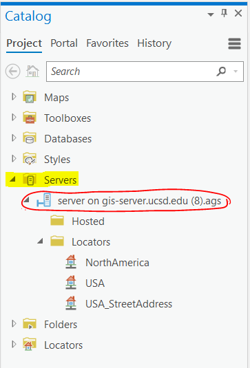
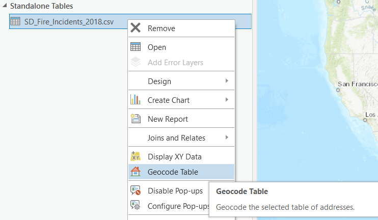
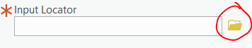
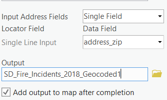

# Geocoding in ArcGIS Enterprise #
This document will take you through the steps required to connect to ArcGIS Enterprise (AGE) and conduct a geocoding task. You can geocode data using the AGE web browser, or connect to the AGE server through the ArcGIS Pro software. 

## Connecting to the UC San Diego Virtual Private Network ##
To use ArcGIS Enterprise, make sure to first download the Cisco AnyConnect Secure Mobility Client and use UCSD's virtual private network (VPN) service. You can find more information [here](https://blink.ucsd.edu/technology/network/connections/off-campus/VPN/). 

**You will need to connect to the VPN before you log into and access AGE.**

## Geocoding from ArcGIS Pro using AGE ##
1. Open up your project on ArcGIS Pro and navigate to the “Insert” tab on the ribbon. In this tab, you should see an icon called **Connections**. Search the dropdown menu and Select **New ArcGIS Server**. 

   

1. When prompted, fill in the Server URL with the address: https://lib-webgis.ucsd.edu/server
*You must have an account inside ArcGIS Enterprise to use this server address. [Fill out this form to request an ArcGIS Enterprise account](https://forms.gle/j2X1fAQEqmgNjiAWA) using your @ucsd.edu email account. If you have issues, please reach out to a Librarian affiliated with the [Library's Data & GIS Lab](https://lib.ucsd.edu/data-gis-lab).*

   

   You can leave the optional authentication fields blank. Once ready, click **OK**.

1. Once the connection has been established, the software will ask you to log into AGE with your credentials. You can log in with **[your AD username]** as the username and your AD password as the password. After this, the setup should complete, and you should now be connected to the AGE server. *You can confirm this by checking **Servers** in the **Catalog Pane** (if you do not see the Catalog Pane, select the first **View** tab on the top ribbon, and select **Catalog Pane** and you should see it appear on the far right of the software window).* 
   
    
    

1. Once you locate the server on the Catalog Pane, go through the files and in the **Locators** folder, ensure you see the NorthAmerica, USA, and USA_StreetAddress locators. *If your addresses are only in the U.S., use the USA locator. If you have addresses in Canada or Mexico, select the NorthAmerica locator*

1. To begin geocoding, add your data to ArcGIS Pro. Right click on the layer and select **Geocode Table**. 

    

1. On the right hand pane, you should now see instructions describing the geocoding process in ArcGIS Pro. You may choose to go through the steps, or experienced geocoders may choose to go directly to the tool. 

   1. Once you have selected the file you wish to geocode, and whether you are going to be geocoding one field or multiple fields, you can select the **locator** for the file.

   1. Whether you choose to go through the steps or directly to the tool, you will need to select the **locator** for the geocoding process. To select a locator from the server, click the **folder icon** next to the **Input Locator** option. 
      
    

      
      
      You should now see the project directory. You can navigate to the locators in the server: 
**
Project >> Servers >> [Server Name] >> Locators
**

   You should see the same locators you saw earlier. Select the one most appropriate for your project and click **OK**. 

   1. Choose the field you are interested in geocoding (depending on if you selected single or multiple address fields, you may have to do this more than once) and confirm the output file name. The default selection on ArcGIS Pro is to add the output to the map. 

      

    

   1. When you are ready, click **Run** at the bottom to begin the geocoding process.

1. The geocoding process may take a few seconds. Once it has completed you should see the statistics for the process (including the number of fields that were successfully matched, the number of fields that were not matched, and the time it took to complete the task). You should also see your geocoded result added as a layer to your project. 

